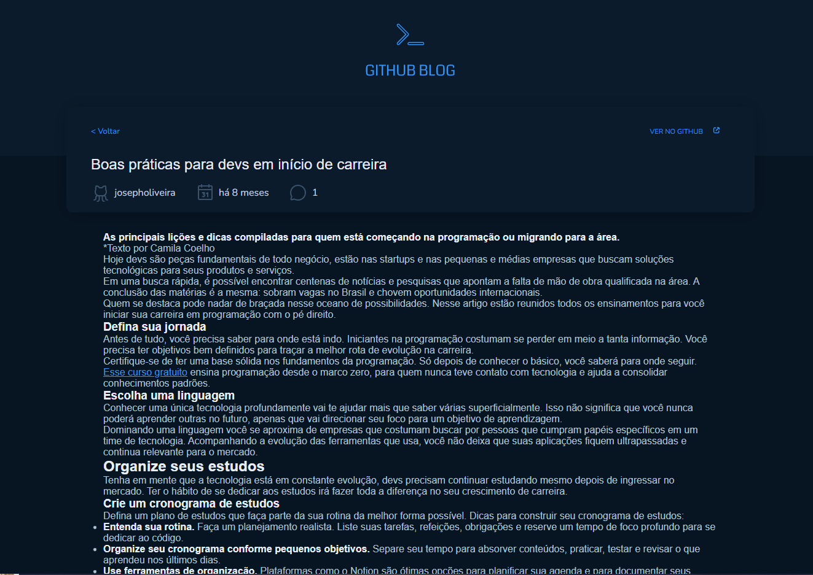

# GitHub Blog

O projeto "GitHub Blog" é uma interface de usuário criada no Figma que permite aos usuários visualizarem informações do perfil de um usuário do GitHub, como nome, foto de perfil, número de seguidores, repositórios e muito mais. A interface de usuário foi criada usando HTML, CSS, TypeScript e React.

O projeto faz uma requisição à API do GitHub para obter os dados do usuário e exibi-los na interface do usuário. A página inicial apresenta um formulário de pesquisa no qual o usuário pode inserir o nome do repositório. O layout é organizado e limpo, com uma mistura de fontes serifadas e sem serifas, além de uma paleta de cores em tons de cinza e preto.

A página de perfil do usuário exibe informações importantes, como o nome, foto de perfil, número de seguidores e repositórios. Além disso, há uma seção de repositórios que exibe todos os repositórios do usuário.

O projeto foi baseado no perfil do GitHub do Diego Fernandes (diego3g), usei o perfil dele para preencher as informações

Em resumo, o projeto "GitHub Blog" é uma interface de usuário elegante e organizada que permite aos usuários visualizarem informações importantes do perfil de um usuário do GitHub de maneira fácil e intuitiva. Ele foi criado com HTML, CSS, TypeScript e React.